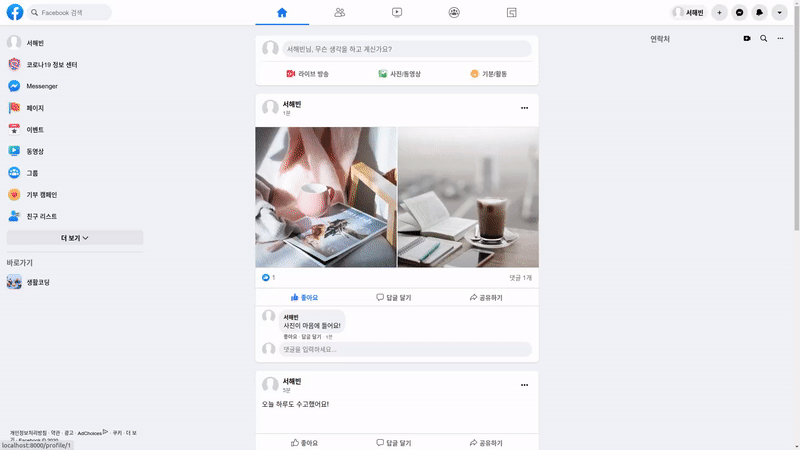
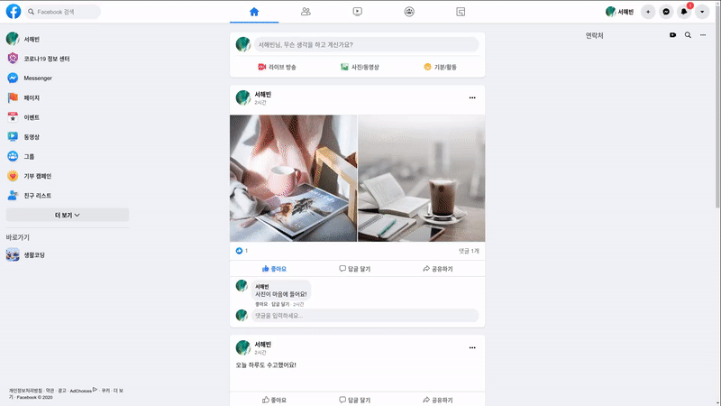

# JS로 구현한 facebook 클론 코딩 v1.x

### 목차
1. 요약
2. 개발환경 및 기술 스택
3. 설치
4. 주요기능

### 1. 요약
서버 개발을 공부하며 Javascript로 구현한 Facebook 클론 프로젝트입니다.
다음과 같은 기능을 제공합니다.
- 회원가입 및 로그인
- 프로필
- 게시글
- 댓글
- 좋아요
- 친구
- 메시지

### 2. 개발 환경 및 기술 스택
#### 환경
Node.js: 14.15.1
Express 4.17.1
OS: Ubuntu 20.04.1 LTS 64bit
CPU: Intel® Core™ i5-8265U CPU @ 1.60GHz × 8
#### 기술 스택
| type                 | stack                           |
| -------------------- | ------------------------------- |
| javascript runtime   | Node.js                         |
| web framework        | Express                         |
| template engine      | Pug                             |
| database             | mysql                           |
| database orm         | sequalize                       |
| socket communication | socket<area>.io                 |
| test                 | mocha, sinon, supertest, should |

### 3. 설치
1. github repository cloning
    ```shell
    $ git clone https://github.com/haebinseo/FacebookClone_Node.git
    ```
2. download modules
    ```shell
    $ npm install
    ```
3. run server
    ```shell
    $ npm start
    ```

### 4. 주요기능
#### 회원가입 및 로그인
회원가입 및 로그인 기능을 제공합니다. 서비스를 사용하기 위해서는 로그인이 필수입니다.
로그인하지 않고 메시지 등의 url 접근시 로그인 페이지로 리다이렉트됩니다.

#### 프로필
사용자의 프로필 기능을 제공합니다. 자신의 프로필 페이지에서 개인 정보나 프로필 이미지를 수정할 수 있습니다. 또한 타임라인과 사진 탭, 친구 탭을 관리할 수 있습니다.
자신이 아닌 타인의 프로필에서는 수정 기능을 제공하지 않습니다.



#### 게시글 및 댓글
다음의 기능을 제공합니다.
- 최근 게시글 읽기 (뉴스피드)
- 게시글 작성/수정/삭제
- 댓글 작성/수정/삭제
- 게시글 및 댓글 좋아요
  


#### 친구
다른 사용자에게 친구 신청을 보낼 수 있습니다.
신청 받은 사용자는 실시간 알림을 받고, 이를 수락하거나 거절할 수 있습니다. (socket 통신 사용)
수락한 경우 두 사용자는 친구가 되며, 메시지를 주고 받을 수 있게 됩니다.

#### 메시지
친구에게 실시간 메시지를 보낼 수 있습니다.
전송한 메시지는 삭제할 수 있습니다.

